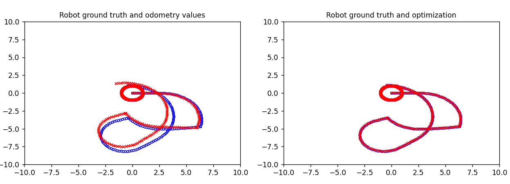
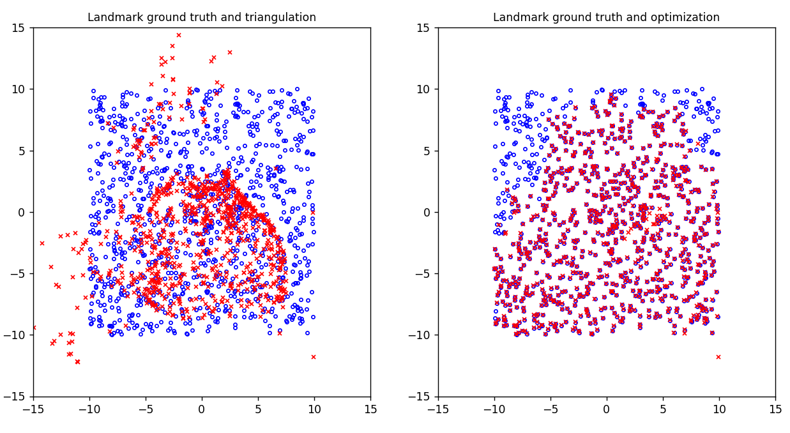

# PR_Project
Planar_monocular_SLAM

The goal of this project is to develop SLAM system using Total Least Square algorithm to determine the trajectory of a planar robot moving in an environment, populated with landmarks, and that perceives it only using a mounted camera.

The proposed solution can be subdivided in three fases:
* Initialization of the landmarks and triangulation of all the available views for each one.
* Optimization of the landmarks by running for some iterations an istance of least square only on landmarks.
* Get the final trajectory by running a total least square both on landmarks and robot poses.

Output:

RMSE evaluation:
Average Rotation Error (in radians): 2.6588369590718163e-06
Average Translation RMSE Error: 0.0010080680581410924